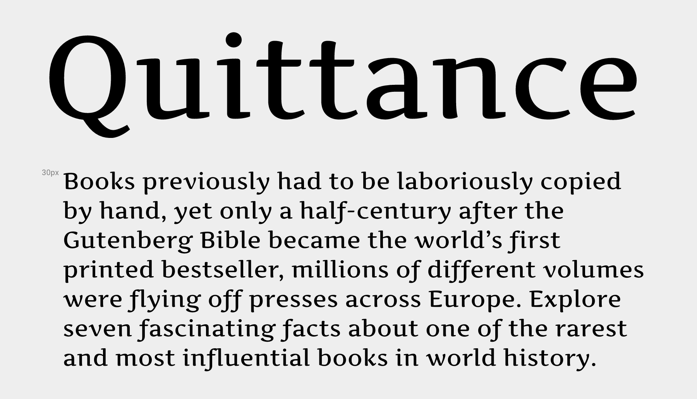

Artifika is an amiable upright italic for fashionable display titling.

Overall features are tender and crisp, descenders short. Settled curves are sculpted with calligraphic elegance, instrokes have a widening as a tribute to it's broad-nib origin.

Nearly horizontal flat serifs support left-to-right direction, making the typeface pleasant for reading on screen.

Designed by Yulya Zhdanova, Ivan Petrov in 2010-2011.

Artifika is a Unicode typeface family that supports 
languages that use the Latin script and its variants, and 
could be expanded to support other scripts.

